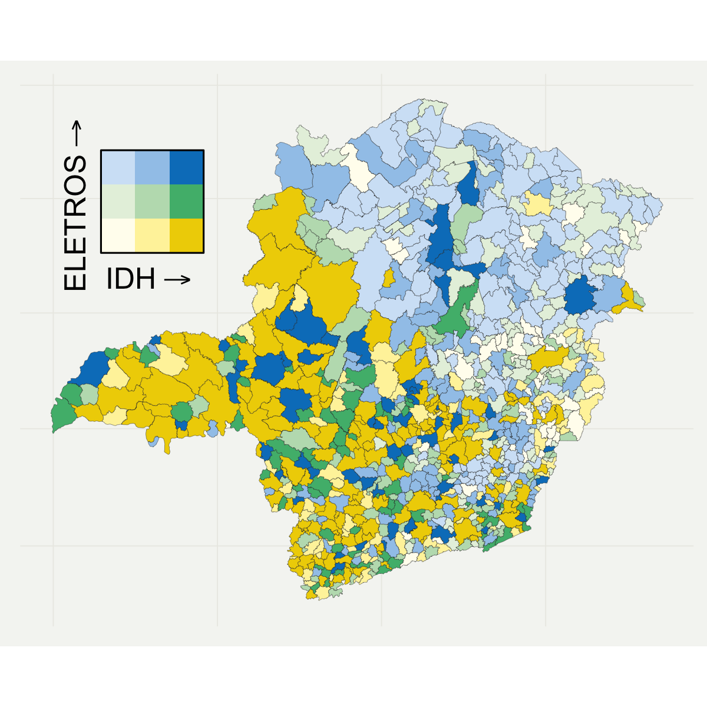

```{r setup, include=FALSE}
options(htmltools.dir.version = FALSE)
library(knitr)
knitr::opts_chunk$set(warning = FALSE, message = FALSE)
# options(knitr.table.format = "html")
library(tidyverse)
library(gt)
library(fontawesome) # from github: https://github.com/rstudio/fontawesome
```

layout: true

<div class="my-footer"><span>lgsilvaesilva.github.io/dataviz</span></div>

<!-- this adds the link footer to all slides, depends on my-footer class in css-->

---
name: xaringan-title
class: right, middle
background-image: url(img/kelli-tungay-2LJ4rqK2qfU-unsplash.jpg)
background-size: cover

# .titleBold[Me desculpem os tolos, mas visualização é essencial]
### .heatinline[Make me pretty, and then I show the findings!]

.medium[Luís Silva e Silva | dataViz | `r format(Sys.Date(), "%dth %B %Y")`]

<!-- this ends up being the title slide since seal = FALSE-->

---

class: right, middle


### Find me at...

[`r fa(name = "twitter")` @lgsilvaesilva](http://twitter.com/lgsilvaesilva)  
[`r fa(name = "github")` @lgsilvaesilva](http://github.com/lgsilvaesilva)  
[`r fa(name = "link")` lgsilvaesilva.github.io](https://lgsilvaesilva.github.io)  
[`r fa(name = "paper-plane")` lgsilvaesilva@gmail.com](mailto:lgsilvaesilva@gmail.com)

---
name: whatviz
class: center, top, inverse
background-image: url(img/jess-bailey-l3N9Q27zULw-unsplash.jpg)
background-size: cover

# .salt[WHAT is <br> data <br> visualization?]

---
name: define_viz
class: left, middle, inverse

# .heatinline[WHAT?]
# _"Visual (interactive) representation of information to help people make sense of complex phenomena through data."_

.footnote[Bertini, Enrico. Professor at NYU Tandon School of Engineering]

---
name: my_define_viz
class: center, middle, inverse

# .left[.heatinline[WHAT?]]

## Data Visualization is the map <br> $f:D\rightarrow G$, <br> where $D$ is the data available, and $G$ is a set of graphics that makes $D$ more accessible, understandable and usable.

---
class: right, middle, inverse
background-image: url(img/pen_yellow.jpg)
background-size: cover

# .large[Example]

---
name: ex_data

## AidData: Financial aids around the world

```{r ex_whatviz, cache=TRUE, highlight.output = 1, eval=require(data.table)}
data_url <- "https://bit.ly/2WTjXwM"
dt <- fread(data_url)
str(dt)
```

+ Count distinct values for each variable

```{r}
dt[, lapply(.SD, uniqueN), .SDcols = !"sum_amount_usd_constant"]
```


---
name: ex_webpage

<iframe src="http://aiddata.herokuapp.com/" width="100%" height="90%" frameBorder = "0", loading = "lazy"></iframe>

.footnote[http://aiddata.herokuapp.com/]

---
name: whyviz
class: center, middle, inverse

# Why <br> .fat[data visualization] <br> matters?

---
name: why_insight
class: left, bottom, inverse
background-image: url(img/insight.jpg)
background-size: cover

---
template: why_insight

# .fancy[.salt[Insights]]

---
template: why_insight

# .fancy[.salt[Hypothesis Testing]]

---
template: why_insight

## .fancy[.salt[Exploratory Data Analysis]]

---
name: snow
class: middle, center

### .left[John Snow Map: cholera outbreak, London, 1854]

.pull-left[


Original map by John Snow showing the clusters of cholera cases in the London epidemic of 1854.

]

--

.pull-right[

]

---
template: snow

.pull-right[

.left[
+ British (1813 - 1858)
+ Physician
]
]

---
template: snow

.pull-right[

]

---
template: whyviz

---
name: why_anscombe
class: right, middle
background-image: url(img/calculator.jpg)
background-size: cover

.pull-right[
## The .fancy[.heatinline[descriptive statistics is not enough]] to tell the whole data story.
]


---
name: anscombe
class: top, center

## Hidden correlations

.pull-left[
```{r r_anscombe, echo=FALSE}
library(datasauRus)
dt_ex <- datasaurus_dozen %>%
  filter(
    dataset %in% c("dino", "star", "circle", "wide_lines")
  ) %>%
  mutate(
    dataset = as.numeric(factor(dataset, levels = c("dino", "star", "circle", "wide_lines")))
  ) %>%
  group_by(dataset) %>%
  summarise(
    mean_x    = mean(x),
    mean_y    = mean(y),
    std_dev_x = sd(x),
    std_dev_y = sd(y),
    corr_x_y  = cor(x, y)
  )

dt_ex %>%
  gt() %>%
  tab_spanner(
    label = "Mean",
    columns = vars(mean_x, mean_y)
  ) %>%
  tab_spanner(
    label = "Stand. Deviation",
    columns = vars(std_dev_x, std_dev_y)
  ) %>%
  cols_label(
    mean_x = "X",
    mean_y = "Y",
    std_dev_x = "X",
    std_dev_y = "Y",
    dataset = "Dataset",
    corr_x_y = "Corr."
  ) %>%
  fmt_number(
    columns = vars(mean_x, mean_y, std_dev_x, std_dev_y, corr_x_y),
    decimals = 1
  )
```

- .left[Linear Regression: ]

$$y = 53 - 0.10\times x$$

.footnote[R package `datasauRus` inspired by Anscombe's Quartet - `anscombe`]
]

--

.pull-right[
```{r plot_dino, out.width='80%', fig.align='top', dev='svg', echo=FALSE, dpi=300, strip.white=TRUE}
dataset_list <- c("dino", "star", "circle", "wide_lines")
datasaurus_dozen %>%
  filter(dataset %in% dataset_list) %>%
  mutate(
    dataset = factor(dataset,
                     levels = dataset_list,
                     labels = paste(1:length(dataset_list), dataset_list, sep = ": "))
  ) %>%
  ggplot(aes(x = x, y = y)) +
  geom_point(color = "#0097FF") +
  theme_light() +
  theme(strip.text = element_text(size = 18)) +
  facet_wrap(~dataset)
```
]

---
template: whyviz

---
name: why_comunicate
class: center, bottom, inverse
background-image: url(img/speaker.jpg)
background-size: cover

---
template: why_comunicate

# .large[Comunicate]

---
template: why_comunicate

# .large[Persuasion]

---
name: nightingale
class: center, middle

### Diagram of the causes of mortality in the army in the East Florence Nightingale
.left-column[
<br>


.left[
+ Statistician (1820 - 1910)
+ 1859: First female member of the Royal Statistical Society.
+ 1874: American Statistical Association.]
]

.right-column[

]

---
template: whyviz

---
name: why_story
class: center, middle, inverse
background-image: url(img/storytelling.jpg)
background-size: cover

---
template: why_story

# Storytelling

---
name: minard
class: center, middle

### Charles Minard's map of Napoleon's disastrous Russian campaign of 1812
.left-column[
<br>


.left[
+ Civil Engineer
+ French
+ 1781 - 1870
]

]

.right-column[

]

---
name: type_viz
class: left, top, inverse

# Data Visualization


.left[
.large[
1. Exploratory Data Analysis `r emo::ji("spanner")`

1. Communication (internal/external) `r emo::ji("speaking")`

1. Scaling up (dashboard; automatic report) `r emo::ji("screen")`
]
]

---
name: viz_explore
class: center, middle
background-image: url(img/brushes.jpg)
background-size: cover

.pull-right[
## .heat[.fancy[Fundamental Charts <br> for data exploring]]
]

---
name: chart_decision
class: center, middle
background-color: #EBECEE

.left-column[
### Fundamental Charts
.left[
+ Histogram
+ Boxplot
+ Scatter plot (points)
+ Line chart
+ Bar plot
+ Map
]
]
.right-column[

]
.footnote[https://www.pinterest.ca/pin/507147608033876776/]

---
name: sec_barplot
class: left, middle, inverse
background-image: url(img/blue_pencil.jpg)
background-size: cover

.pull-right[
# .large[.fancy[Barplot]]
.left[
+ ### 1 categorical key; 1 quantitative value

+ ### Ordering

+ ### Labels

+ ### Highlight
]
]


---
name: barplot

```{r read_enem, include=FALSE, eval = require(data.table), cache=TRUE}
mg_enem <- fread("../enem_mg.csv")

# Até que série sua mãe, ou a mulher
# responsável por você, estudou?
q002_df <- mg_enem %>%
  group_by(Q002) %>%
  summarise(
    NU_NOTA_MT = round(mean(NU_NOTA_MT, na.rm = T), 1),
    NOT_NA = sum(!is.na(NU_NOTA_MT))
  )
```


.pull-left[

```{r plot-bar1, fig.show = 'hide'}
# Até que série sua mãe, ou a mulher
# responsável por você, estudou?
ggplot(data = q002_df, aes(x = NU_NOTA_MT, y = Q002)) +
  geom_col() +
  geom_text(
    aes(label = NU_NOTA_MT, x = NU_NOTA_MT - .25),
    color = "white",
    size = 5,
    hjust = 1
  )
```
]
.pull-right[
```{r ref.label = 'plot-bar1', echo = FALSE, dpi=300}
```
]

---
name: barplot2

.pull-left[

```{r plot-bar2, fig.show = 'hide'}
# Até que série sua mãe, ou a mulher
# responsável por você, estudou?
q002_df %>%
  mutate(Q002 = stringr::str_wrap(Q002, 20)) %>% #<<
  ggplot(aes(x = NU_NOTA_MT, y = Q002)) +
  geom_col() +
  geom_text(
    aes(label = NU_NOTA_MT, x = NU_NOTA_MT - .25),
    color = "white",
    size = 5,
    hjust = 1
  ) +
  labs(x = "Proficiência média Matemática") + #<<
  theme(
    axis.title.y = element_blank() #<<
  )
```

<br><br><br><br>
## .fancy[Format labels]

]
.pull-right[
```{r ref.label = 'plot-bar2', echo = FALSE, dpi=300}
```
]

---
name: barplot3

.pull-left[

```{r plot-bar3, fig.show = 'hide', dpi=300}
# Até que série sua mãe, ou a mulher
# responsável por você, estudou?
q002_df %>%
  mutate(Q002 = stringr::str_wrap(Q002, 20)) %>%
  arrange(NU_NOTA_MT) %>%        #<<
  mutate(Q002 = fct_inorder(Q002)) %>% #<<
  ggplot(aes(x = NU_NOTA_MT, y = Q002)) +
  geom_col() +
  geom_text(
    aes(label = NU_NOTA_MT, x = NU_NOTA_MT - .25),
    color = "white",
    size = 5,
    hjust = 1
  ) +
  labs(x = "Proficiência média Matemática") +
  theme(
    axis.title.y = element_blank()
  )
```

<br><br><br><br>
## .fancy[Rearranging axis]

]
.pull-right[
```{r ref.label = 'plot-bar3', echo = FALSE, dpi=300}
```
]

---
name: barplot4

.pull-left[

```{r plot-bar4, fig.show = 'hide', dpi=300}
# Até que série sua mãe, ou a mulher
# responsável por você, estudou?
q002_df %>%
  mutate(Q002 = stringr::str_wrap(Q002, 20)) %>%
  arrange(NU_NOTA_MT) %>%
  mutate(Q002 = fct_inorder(Q002),
         studied = ifelse(Q002 == "Nunca estudou", T, F)) %>% #<<
  ggplot(aes(x = NU_NOTA_MT, y = Q002, fill = studied)) +
  geom_col() +
  geom_text(
    aes(label = NU_NOTA_MT,
        x = NU_NOTA_MT - .25),
    color = "white",
    size = 5,
    hjust = 1
  ) +
  scale_fill_manual(
    values = c("#B0B0B0D0", "#0097FFD0") #<<
  ) +
  cowplot::theme_minimal_vgrid(11) + #<<
  labs(x = "Proficiência média Matemática") +
  theme(
    legend.position = "none", #<<
    axis.title.y = element_blank() #<<
  )
```

## .fancy[Highlighting]

]
.pull-right[
```{r ref.label = 'plot-bar4', echo = FALSE, dpi=300}
```
]

---
name: grouped_barplot1

.pull-left[

```{r plot-bargroup1, fig.show = 'hide', dpi=300, eval=require(ggthemes)}
mg_enem %>%
  select(TP_SEXO, NU_NOTA_CN:NU_NOTA_MT) %>%
  rename("SEXO" = TP_SEXO,
         "Ciências da Natureza" = NU_NOTA_CN,
         "Ciências Humanas" = NU_NOTA_CH,
         "Linguagens" = NU_NOTA_LC,
         "Matemática" = NU_NOTA_MT) %>%
  melt(1) %>%
  group_by(SEXO, variable) %>%
  summarise(value = mean(value, na.rm = T)) %>%
  ggplot(aes(x = value, y = SEXO, fill = variable)) +
  geom_col(position = "dodge") + #<<
  theme_hc(base_size = 16) + #<<
  labs(x = "Proficiência média", y = "", fill = "") +
  scale_fill_tableau(guide = guide_legend(ncol = 2)) #<<

```

<br><br><br>
## .fancy[Grouped Bar Chart]

]
.pull-right[
```{r ref.label = 'plot-bargroup1', echo = FALSE, dpi=300}
```
]

---
name: grouped_barplot2

.pull-left[

```{r plot-bargroup_grey, fig.show = 'hide', dpi=300, eval=require(ggthemes), cache=TRUE}
mg_enem %>%
  select(TP_SEXO, NU_NOTA_CN:NU_NOTA_MT) %>%
  rename("SEXO" = TP_SEXO,
         "Ciências da Natureza" = NU_NOTA_CN,
         "Ciências Humanas" = NU_NOTA_CH,
         "Linguagens" = NU_NOTA_LC,
         "Matemática" = NU_NOTA_MT) %>%
  melt(1) %>%
  group_by(SEXO, variable) %>%
  summarise(value = mean(value, na.rm = T)) %>%
  ggplot(aes(x = value, y = SEXO, fill = variable)) +
  geom_col(position = "dodge") + #<<
  theme_hc(base_size = 16) + #<<
  labs(x = "Proficiência média", y = "", fill = "") +
  scale_fill_grey(guide = guide_legend(ncol = 2)) #<<

```

<br><br><br>
## .fancy[Grouped Bar Chart]

]
.pull-right[
```{r ref.label = 'plot-bargroup_grey', echo = FALSE, dpi=300}
```
]

---
name: linechart
class: left, middle
background-image: url(img/line_chart.jpg)
background-size: cover

.pull-right[
# .large[.fancy[Line chart]]
.left[
+ ### 1 ordinal key; 1 quantitative value

+ ### Labels

+ ### Highlight
]
]

---
name: linechart1

.pull-left[
```{r setup_line, include=FALSE, eval=require(COVID19)}
covid_df <- covid19(verbose = F)
bra_ita_df <- covid_df %>%
  filter(id %in% c("BRA" , "ITA")) %>%
  group_by(id) %>%
  mutate(
    new_cases = confirmed - lag(confirmed),
    ave_new_cases = zoo::rollmean(new_cases, 7, na.pad = TRUE, align = "right")
  ) %>%
  filter(!is.na(new_cases), !is.na(ave_new_cases))

label_df <- data.frame(
  x = as.Date(c("2020-05-01", "2020-07-16", "2020-03-21")),
  y = c(250, 167, 108),
  label = c("Arrival in Brazil", "Brazil", "Italy")
)
```

```{r plot-line1, fig.show = 'hide', dpi=300}
bra_ita_df %>%
  ggplot(aes(x = date)) +
  geom_line(aes(y = 1e6 * new_cases/population, color = id))
```

<br><br><br>

## .fancy[Line Chart]
## .fancy[Exploratory Data Analysis]

]
.pull-right[
```{r ref.label = 'plot-line1', echo = FALSE, dpi=300}
```
]

---
name: linechart2

.pull-left[
```{r plot-line2, fig.show = 'hide', dpi=300}
pl2 <- bra_ita_df %>%
  ggplot(aes(x = date)) +
  geom_line(aes(y = 1e6 * new_cases/population, color = id)) +
  labs(y = "New cases per 100k inhab.",
       title = "COVID19",
       subtitle = "Daily new cases",
       caption = "Source: COVID-19 Data Hub") +
  scale_color_manual(values = c("#00798c", "#2e4057")) + #<<
  cowplot::theme_minimal_hgrid() + #<<
  theme( #<<
    legend.position = "none",
    axis.title.x = element_blank(),
    plot.title = element_text(hjust = 0, face = "plain")
  )
pl2
```

<br>
## .fancy[Communicating]


]
.pull-right[
```{r ref.label = 'plot-line2', echo = FALSE, dpi=300}
```
]

---
name: linechart3

.pull-left[
```{r plot-line3, fig.show = 'hide', dpi=300}
pl2 +
  geom_vline(xintercept = as.Date("2020-06-30"), linetype = "dashed", color = "gray50") +
  geom_label( #<<
    data = label_df,
    aes(x = x, y = y, label = label),
    hjust = 0,
    lineheight = .8,
    inherit.aes = FALSE,
    label.size = NA
  ) +
  geom_curve( #<<
    data = data.frame(x = as.Date("2020-06-01"), y = 250, xend = as.Date("2020-06-30"), yend = 250),
    mapping = aes(x = x, y = y, xend = xend, yend = yend),
    colour = "grey75",
    size = 0.5,
    curvature = -0.1,
    arrow = arrow(length = unit(0.01, "npc"), type = "closed"),
    inherit.aes = FALSE
  )
```

### .fancy[Communicating]
### .fancy[Contextualizing]
]

.pull-right[
```{r ref.label = 'plot-line3', echo = FALSE, dpi=300}
```
]

---
name: line_highlight

.pull-left[
```{r pre_line_highlight, include=FALSE}
df_100 <- covid_df %>%
  mutate(
    new_cases = confirmed - lag(confirmed),
    ave_new_cases = zoo::rollmean(new_cases, 7, na.pad = TRUE, align = "right")
  ) %>%
  filter(deaths > 100) %>%
  arrange(id, date) %>%
  group_by(id) %>%
  mutate(day = 1:n())

highlight <- c("ITA", "ESP", "GBR", "FRA", "DEU", "USA", "BRA", "MEX", "JPN")
covid_highlight <- df_100 %>%
  ggplot(aes(x = day, y = deaths, group = id)) +
  geom_line(size = 1.25, alpha = 0.75, color = "#0097ff") +
  scale_y_continuous(
    trans='log10',
    labels = scales::number_format(accuracy = 0.1, big.mark = ",")
  ) +
  labs(x = "Days after 1,00th reported death", y = "Reported deaths (log scale)") +
  scale_color_tableau() +
  theme_minimal() +
  theme(
    plot.title.position = "plot",
    plot.caption.position =  "plot",
    plot.caption = element_text(hjust = 0),
    axis.title.x = element_text(hjust = 1),
    axis.title.y = element_text(hjust = 1),
  )
```

```{r line_highlight1, fig.show = 'hide', dpi=300, eval=require(gghighlight), cache=TRUE}
highlight <- c("ITA", "ESP", "GBR", "FRA", "DEU", "USA", "BRA", "MEX", "JPN")
df_100 %>%
  ggplot(aes(x = day, y = deaths, group = id, color = iso_alpha_3)) +
  geom_line(size = 1.25, alpha = 0.75) +
  scale_y_continuous(
    trans='log10',
    labels = scales::number_format(accuracy = 0.1, big.mark = ",")
  ) +
  labs(x = "Days after 1,00th reported death", y = "Reported deaths (log scale)") +
  gghighlight(iso_alpha_3 %in% highlight, #<<
              label_key = iso_alpha_3, use_direct_label = TRUE,
              label_params = list(segment.color = NA, nudge_x = 1),
              use_group_by = FALSE) +
  scale_color_tableau() +
  theme_wsj() +
  theme(
    plot.title.position = "plot",
    plot.caption.position =  "plot",
    plot.caption = element_text(hjust = 0),
    axis.title.x = element_text(hjust = 1),
    axis.title.y = element_text(hjust = 1),
  )
```
## .fancy[Highlighting]
]

.pull-right[
```{r ref.label = 'line_highlight1', echo = FALSE, dpi=300}
```
]

---
name: small_multiple

### Small Multiples

.pull-left[
```{r small_multiple, fig.show = 'hide', dpi=300, cache=TRUE}
covid_highlight +
  gghighlight(iso_alpha_3 %in% highlight,
              use_group_by = FALSE,
              use_direct_label = FALSE,
              unhighlighted_colour = "grey90") +
  facet_wrap(vars(iso_alpha_3)) + #<<
  theme(
    legend.position = "none"
  )
```

## .fancy[Comparison]

]

.pull-right[
```{r ref.label = 'small_multiple', echo = FALSE, dpi=300}
```
]

---
name: note_barline
class: left, middle
background-image: url(img/notes.jpg)
background-size: cover

.pull-rightnote[
+ .fancy[.saltinline[Bar chart]: categorical (multiple), <br> and quantitative]

+ .fancy[.saltinline[Line chart]: temporal, categorical (color), <br> and quantitative]
+ .heatinline[~~To connect categorical data~~]

+ .fancy[Use of colors to focus attention]

+ .fancy[Labels: font, size, short]

+ .fancy[Contextualizing with helper text]

+ .fancy[Comparison]
]

---
name: var_continuos
class: left, middle
background-image: url(img/markus-spiske-k0rVudBoB4c-unsplash.jpg)
background-size: cover

.pull-right[
# .large[.fancy[Quantitative variable]]
.left[
+ ### Summary statistics

+ ### Distribution

+ ### Correlation
]
]


---
name: density1

## Density

.pull-left[
```{r density, fig.show = 'hide', dpi=300, cache=TRUE}
density_colors <- c( "#D9D9D9", "#019E73", "#57B4E9")
mg_enem %>%
  filter(NU_NOTA_LC > 0) %>%
  mutate(capital = NO_MUNICIPIO_RESIDENCIA == "Belo Horizonte") %>%
  ggplot(aes(x = NU_NOTA_LC, y = ..count.., color = TP_SEXO)) +
  geom_density(
    data = function(x) select(x, -TP_SEXO),
    aes(fill = "all participants", color = "all participants")
  ) +
  geom_density(aes(fill = TP_SEXO, color = TP_SEXO)) +
  facet_wrap(vars(TP_SEXO)) +
  scale_color_manual(name = NULL, values = density_colors) +
  scale_fill_manual(name = NULL, values = density_colors) +
  cowplot::theme_minimal_hgrid(16) +
  theme(legend.position = "bottom", legend.justification = "center")
```

## .fancy[Distribution]
]

.pull-right[
```{r ref.label = 'density', echo = FALSE, dpi=300}
```
]

---
name: boxplot

## Boxplot

.pull-left[
```{r boxplot, fig.show = 'hide', dpi=300, cache=TRUE}
box_colors <- c("#019E73", "#57B4E9")
mg_enem %>%
  filter(NU_NOTA_LC > 0) %>%
  ggplot(aes(x = NU_NOTA_LC, y = TP_SEXO, color = Q025)) +
  geom_boxplot() +
  labs(x = "",
       y = "Nota: Linguagens e Códigos",
       caption = "Source: ENEM 2019") +
  scale_color_manual(name = NULL, values = box_colors) +
  cowplot::theme_minimal_hgrid(12) +
  theme(legend.position = "bottom", legend.justification = "center")
```

## .fancy[Summary statistics]
]

.pull-right[
```{r ref.label = 'boxplot', echo = FALSE, dpi=300}
```
]

---
name: scatter_plot

## Scatter plot

.pull-left[
```{r scatter1, fig.show = 'hide', dpi=100, cache=TRUE}
mg_enem %>%
  filter(NU_NOTA_LC > 0 & NU_NOTA_MT > 0) %>%
  ggplot(aes(x = NU_NOTA_LC, y = NU_NOTA_MT)) +
  geom_point(alpha = 0.01) +
  cowplot::theme_minimal_hgrid(12)
```

## .fancy[Correlation]
]

.pull-right[
```{r ref.label = 'scatter1', echo = FALSE, dpi=150}
```
]

---
name: scatter_plot

## Scatter plot

.pull-left[
```{r scatter2, fig.show = 'hide', dpi=100, cache=TRUE}
mg_enem %>%
  filter(NU_NOTA_LC > 0 & NU_NOTA_MT > 0) %>%
  ggplot(aes(x = NU_NOTA_LC, y = NU_NOTA_MT)) +
  # geom_point(alpha = 0.01) +
  stat_bin2d(bins = 50) +
  scale_fill_gradient(low = "lightblue", high = "darkred") + #<<
  theme_bw()
```

## .fancy[Correlation]
## .fancy[Density]
]

.pull-right[
```{r ref.label = 'scatter2', echo = FALSE, dpi=150}
```
]

---
name: note_barline
class: left, middle
background-image: url(img/notes.jpg)
background-size: cover

.pull-rightnote[
+ .fancy[.saltinline[Density chart]: data distribution]

+ .fancy[.saltinline[Density chart]: comparison]

+ .fancy[.saltinline[Boxplot]: data distribution]

+ .fancy[.saltinline[Boxplot]: summary statistics]

+ .fancy[.saltinline[Boxplot]: comparison]

+ .fancy[.saltinline[Scatter]: correlation]

+ .fancy[.saltinline[Scatter]: density]

]

---
name: maps
class: left, middle, inverse
background-image: url(img/maps.jpg)
background-size: cover

.pull-right[
# .large[.fancy[Mapping]]
.left[
+ ### Location

+ ### Distribution

+ ### Density
]
]

---
name: voronois

## % votes x avg. income

+ Voronoi

.center[

]

---
name: mapa_legenda1

## Legend as a chart I

.center[

]

---
name: mapa_legenda2

## Legend as a chart II

.center[

]

---
name: mapa_bivariate
background-color: #F5F5F2

## Bivariate map

.center[

]

---
name: color
class: center, middle, inverse
background-image: url(img/colors.jpg)
background-size: contain

# .large[.fancy[Colors]]

---
name: color_brewer

## R Color Brewer’s palettes

.center[
```{r echo=FALSE}
RColorBrewer::display.brewer.all()
```
]

---
name: virids

## Viridis palettes

Inside the Viridis library there are four options: "magma" (or "A"), "inferno" (or "B"), "plasma" (or "C"), "viridis" (or "D", the default option).

.center[

]

---
name: colorblindr

## colorblindr

Simulate colorblindness in production-ready R figures.

.center[
```{r colorblindr1, echo=FALSE, dpi=100, cache=TRUE}
scales::show_col(colorblindr::palette_OkabeIto, ncol = 8)
```
]

---
name: color
class: left, middle, inverse
background-image: url(img/wall_robot.jpg)
background-size: cover

# .large[.fancy[Automation]]

.pull-left[

###+ Dashboard
###+ Automatic report
###+ Planning
###+ Draft

]

---
name: shiny

## Shiny R package

<iframe src="https://foodandagricultureorganization.shinyapps.io/paris21/" width="100%" height="75%" frameBorder = "0", loading = "lazy"></iframe> 

---
name: report1

## Reports

.center[

]


---
name: report2

## Reports

.center[

]

---
name: report3

## Reports

.center[

]

---
name: bib
class: right, middle, inverse
background-image: url(img/bib.jpg)
background-size: cover

# .large[.fancy[References]]

.pull-right[
.left[
+ https://www.edwardtufte.com/tufte/

+ http://www.fernandaviegas.com/

+ https://courses.cs.washington.edu/courses/cse512/19sp/index.html

+ http://enrico.bertini.io/

+ https://r-graphics.org/ (.heatinline[The best!])

+ https://twitter.com/nytgraphics?lang=en

+ https://www.nytimes.com/interactive/2019/12/30/us/2019-year-in-graphics.html

+ https://vis.gl/

+ How R Helps Airbnb Make the Most of Its Data: https://peerj.com/preprints/3182.pdf
]
]

---

class: right, middle


### Obrigado!

[`r fa(name = "twitter")` @lgsilvaesilva](http://twitter.com/lgsilvaesilva)  
[`r fa(name = "github")` @lgsilvaesilva](http://github.com/lgsilvaesilva)  
[`r fa(name = "link")` lgsilvaesilva.github.io](https://lgsilvaesilva.github.io)  
[`r fa(name = "paper-plane")` lgsilvaesilva@gmail.com](mailto:lgsilvaesilva@gmail.com)


